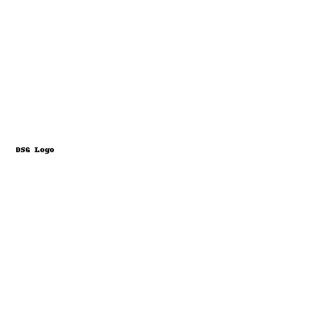

# DSG • ŽREB 🥋



Jednostavna aplikacija za pravljenje žreba/turnira sa brendingom **Decisive Strike Gym**.

---

## 📸 Pregled aplikacije

*(Ovdje ubaci screenshot aplikacije u akciji)*

---

## 🚀 Postavljanje na GitHub Pages

1. Napravi **public** repo na GitHub-u, npr. `dsg-zreb`.
2. Otpakuj ZIP koji si dobio od mene i **uploaduj** fajlove (`index.html`, `README.md`, `.nojekyll`, `404.html` i `logo.png`) u repozitorijum.
3. U *Settings → Pages* podesi:
   - **Source:** Deploy from a branch
   - **Branch:** `main` / root (`/`)
4. Sačekaj ~30 sekundi i otvori link koji se pojavi u *Settings → Pages* (npr. `https://<tvoj-username>.github.io/dsg-zreb/`).

---

## ✨ Funkcionalnosti

- Više kategorija, automatski **Apsolutna kategorija** od pobednika
- Borbe za 3. mesto
- CSV/Excel izvoz rezultata
- Štampa/PDF
- Potpuno **offline** rad
- **Brendiranje**: logo, boje, watermark

---

## 🖼️ Brendiranje

1. U sekciji **0) Brending** učitaj svoj logo (`logo.png`).
2. Postavi naziv, boje i jačinu watermark-a.
3. Klikni **Primeni brending**.

---

## 📂 Struktura fajlova

```
index.html    # Aplikacija
README.md     # Ovaj fajl
.nojekyll     # Isključuje Jekyll na GitHub Pages
404.html      # Fallback stranica
logo.png      # Tvoj logo
```

---

## 📜 Licenca

Ovaj projekat je privatni alat za **Decisive Strike Gym** i nije namenjen javnoj distribuciji bez odobrenja.

